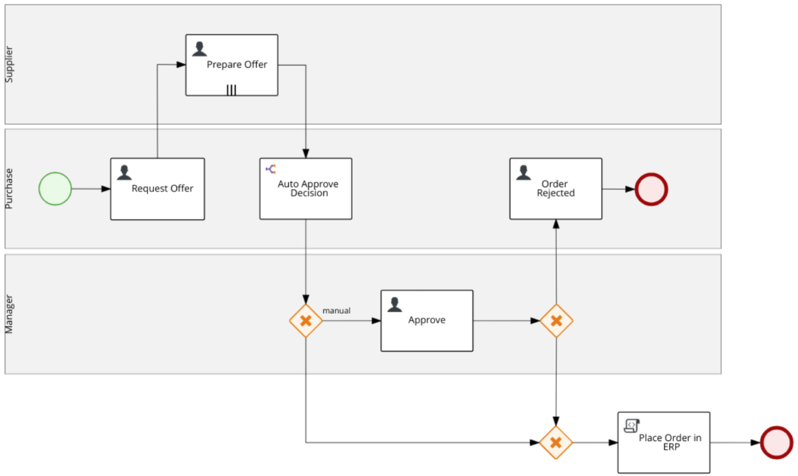

Red Had Process Automation Manager - Order Management Demo Repository
=====================================================================

**Red Had Process Automation Manager** is 100% open source and the upstream effort is known as [jbpm](http://www.jbpm.org).

How to import this demo project
-----------------------------------

This repository can be imported in your Business Central following these steps:

1. From Home page *click* **Design**
2. In header section where is the space name (e.g. myteam) *select the kebab icon* (the 3 vertical dots icon)
3. *Select* **Import Project**
4. *Fill the* **Repository URL** field with this githup repository URL and, finally, *select* **Import**

Task Assignment
-----------------------------------

- Task: **Request Offer** - User Group: `rest-all`
- Task: **Prepare Offer** - Dynamically assigned to the `actorId = #{supplierInfo.user}`
- Task: **Approve** - User Group: `Administrators`
- Task: **OrderRejected** - User Group: `rest-all` (Routed to the Swim lane Actor)

Order Management BPMN Diagram
-----------------------------------

Demo script
-----------------------------------

1. An employee submit a request to the company purchase department. To start the process, s/he has to select the item and the urgency.
    - Look at process diagram, the BPMN diagram is the common language among Business Analysts and PAM practitioner. In this picture, the business stakeholder can recognise the process where s/he is involved in and get visibility on it.
    - Select the process instance list: users can understand and search process instances and easily investigate the status.

2. The purchase expert finds the *Request Offer* in her/his task list, starting the task s/he can define the category of the order and the supplier who will be asked to provide an offer.

3. The supplier employee finds the *Prepare Offer* in her/his task list, starting the task s/he can select the delivery date and the best offer for the item.

4. The *Auto Approval Rule* based on the order features decides whether to involve a manager to confirm the order.

    - e.g. an order which item is basic category and the amount is less than 500 is automatically approved

    

5. If a manager is involved, s/he has to take over the *Approve* task, where s/he can approve or reject the order providing a motive.

6. If the manager rejects the order, the purchase expert receives the *Order Reject* task to acknowledge the order rejection reason.

7. The process happy path completes approving the order, the final step is an integration task that send the order information to the ERP system in order to finalize the order.

### Before the demo

- create some process instances with different users in order to show process charts

Change Log
-----------------------------------

- 2019-01-29: changed user group to match existing one in OCP standard image.